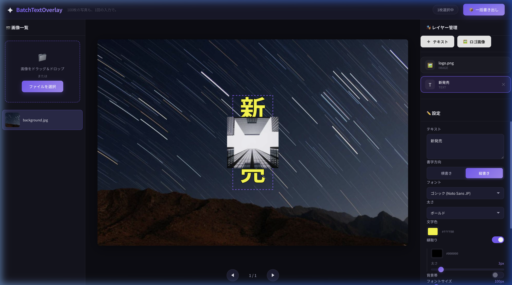
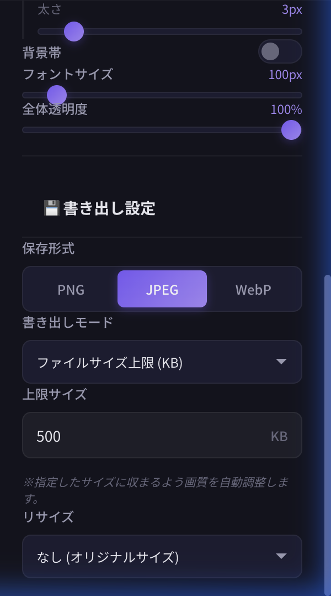
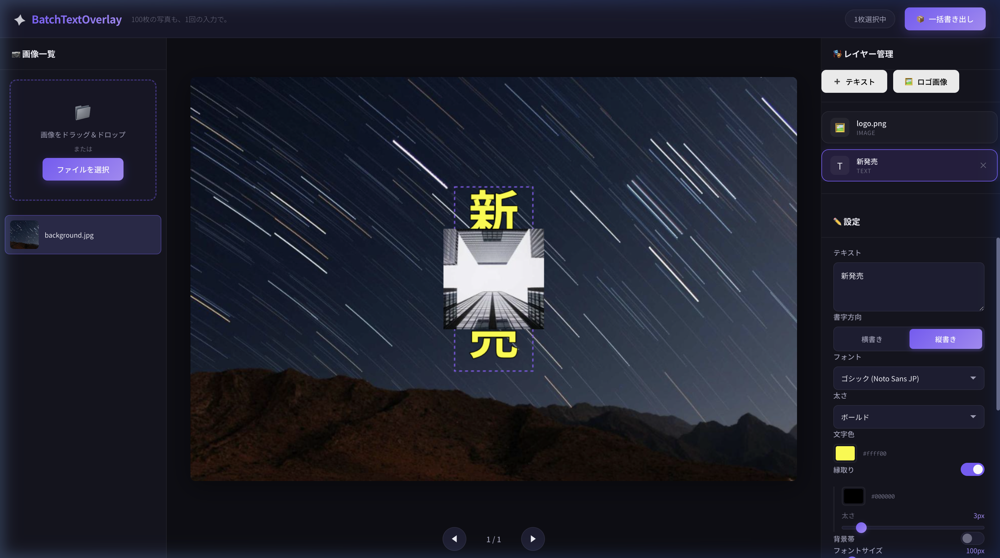

# SuguMoji（スグモジ） PR文章案集

## 1. X (旧Twitter) 用
インパクト重視で、画像編集の「面倒くささ」を解消することを伝えます。

### 案A：時短・効率化（フリマ・ショップ運営向け）
```text
100枚の写真も、1回の入力で。✨

複数の画像に一括で店名やロゴを入れられる「SuguMoji（スグモジ）」を公開しました！

✅ 複数テキスト＆ロゴ挿入対応
✅ 日本語の「縦書き」も美しく
✅ 入力履歴を自動保存。同じ文章もワンクリックで再利用
✅ 「500KB以下」などの指定サイズに自動調整

ブラウザで完結。登録不要・無料です。
🔗 https://daruma-ad.github.io/sugumoji/

#作業効率化 #EC運営 #便利ツール #個人開発
```

### 案B：技術・機能推し（制作・ブログ・クリエイター向け）
```text
画像の「一括文字入れ」で消耗してる人へ。

爆速でウォーターマークや文字を入れられるツールをアップデートしました。
特筆すべきは「インテリジェント書き出し」。

WebP/JPEG形式を選んで「〇〇KB以下」と指定するだけで、画質を自動調整して保存してくれます。
容量制限のあるサイトへの投稿が劇的に楽に！

🔗 https://daruma-ad.github.io/sugumoji/

#便利アプリ #Web制作 #SuguMoji（スグモジ）
```

---

## 2. Instagram 用
スワイプ投稿（1枚目：タイトル、2枚目以降：操作画面）のキャプション用。

### キャプション案
```text
【神ツール】100枚の画像に、一瞬で文字入れ完了！✨

SNS投稿や商品写真、1枚ずつ文字を入れていませんか？
「SuguMoji（スグモジ）」なら、たった1回の操作で
全画像に同じ装飾を施せます。

💡 ここがポイント！
・お洒落な「縦書き」にも完全対応
・ロゴ画像の挿入も自由自在（透過PNG対応）
・「500KB以内」など、ファイルサイズを自動調整
・一度打った文字は「履歴」から即・再利用可能！
・インストール不要！ブラウザですぐ使える

手作業の時間を、クリエイティブな時間に変えましょう。

詳細はプロフィールのリンクから 🔗
または「SuguMoji（スグモジ）」で検索！

#時短術 #SNSマーケティング #インスタ運営 #画像編集 #作業効率化 #便利グッズ #SuguMoji（スグモジ） #ショップ運営
```

---

## 3. ブログ / note 用
開発の背景や、「なぜこのアプリが必要か」というベネフィットを深掘りします。

### 構成案
```markdown
# 100枚の写真も1秒で。一括文字入れ＆サイズ最適化アプリ『SuguMoji（スグモジ）』をリリースしました

「大量の商品写真に店名を入れたい」「SNS投稿用に全部の画像を一括でリサイズしたい」
そんな日常のちょっとした、でも面倒な作業を解決するために、画像編集ツール『SuguMoji（スグモジ）』を開発しました。

## なぜ作ったのか？
画像1枚に文字を入れるのは簡単です。でも、それが10枚、50枚、100枚となったらどうでしょうか？
これまでのツールでは「機能が足りない」か「操作が複雑すぎる」かのどちらかでした。
そこで、「シンプルだけどプロ仕様」を目指して以下の機能を詰め込みました。

## 主な特徴

### 1. 自由度の高いレイヤー管理
テキストは何個でも追加可能。フォント、色、縁取り、背景帯まで細かく設定できます。
さらに、ショップのロゴなどの画像（透過PNG等）も重ねられます。

### 2. こだわりの和文（縦書き）対応
日本語ならではの「縦書き」にも美しく対応。
SNSの告知画像や、和風のデザインにもぴったりです。

### 3. 書き出しのスマート化（インテリジェント・エクスポート）
「ファイルサイズを500KB以下に抑えたい」といった指定が可能になりました。
アプリが自動で最適な画質を計算し、一括で指定サイズ内に収めて書き出します。

### 4. 入力の手間を削る「テキスト履歴＆プリセット」
過去に入力した文章は自動的に保存され、チップ形式で一覧表示されます。
「SALE」や「店名」など、よく使うワードをピン留めしておけば、毎回入力する手間はもうありません。

## 活用シーン
- **フリマアプリやECサイト**への大量出品
- **SNS（X/インスタ）**への透かし入り画像投稿
- **ブログ記事用**の画像一括リサイズ・軽量化

## すぐに使えます（無料・登録不要）
インストールも会員登録も不要です。ブラウザで開いて画像をドロップするだけ。

🔗 [SuguMoji（スグモジ）を使ってみる](https://daruma-ad.github.io/sugumoji/)

皆さんの作業時間が、少しでも短縮されれば幸いです！
```

---

## 4. サムネイル・画像構成案
SNSやブログで目を引くためのビジュアル構成案です。

### パターンA：ビフォー・アフター型（X / インスタ向き）
- **左側**: 文字のない元の写真がバラバラと重なっている様子（「1枚ずつやるのは大変...」というテキスト）
- **右側**: すべてに綺麗にロゴと「SALE」の文字が入った写真が整列している様子（「一瞬で完了！」という強調テキスト）
- **中央**: アプリのロゴまたは「SuguMoji（スグモジ）」の文字

### パターンB：機能凝縮型（ブログのアイキャッチ向き）
- **背景**: アプリの操作画面（ダークモードのスタイリッシュなUI）
- **中央テキスト**: 「100枚一括」「文字入れ＆リサイズ」「ファイルサイズ自動調整」を大きな文字で配置
- **要素**: 縦書きのテキスト例と、ロゴ画像が合成されているプレビュー画面、そして「最近使った文字」が並ぶ履歴エリアを強調

### パターンC：スマホ・PC両対応アピール（note / X向き）
- **ビジュアル**: ノートPCの画面にアプリが表示されており、その横にスマホを置く
- **コピー**: 「インストール不要。ブラウザを開くだけで、プロの仕上がり。」

### 推奨キャッチコピー（画像内に入れる文字）
- **「手作業、卒業。」**
- **「一括文字入れの新常識」**
- **「和の美しさ、縦書き対応。」**

---

## 5. キャプチャした画像素材 (PR Assets)
PRにそのまま使える高品質なスクリーンショットです。

### メインダッシュボード (Creative Mode)

- **用途**: Xやインスタの1枚目、ブログのアイキャッチ。
- **特徴**: 縦書き「新発売」、ロゴ挿入、編集ハンドルの様子が一度に伝わります。

### 書き出し設定 (Smart Export)

- **用途**: 技術的な凄さを伝える、機能解説の2枚目。
- **特徴**: 「ファイルサイズ上限 (KB)」というユニークな機能を強調しています。

### レイヤー管理 (Layer List)

- **用途**: 操作のしやすさを伝える、補足画像。
- **特徴**: 複数の要素をシンプルに管理できるUIが伝わります。

### テキスト履歴 (Quick Presets)

- **用途**: 効率性を伝える、補足画像。
- **特徴**: ワンクリックで文字を切り替えられるスピード感を伝えます。

---

## 6. 15秒CM構成案 (Storyboard JSON)
SNS（YouTube Short, TikTok, Instagram Reels）での広告や紹介動画に使える、15秒の動画構成案です。

```json
{
  "title": "SuguMoji 15s Product Intro",
  "duration": "15s",
  "target": "EC sellers, SNS creators",
  "scenes": [
    {
      "time": "0-3s",
      "visual": "大量の未編集写真が散乱している画面から、SuguMojiのロゴへズームイン",
      "copy": "その文字入れ、まだ1枚ずつやってる？",
      "audio": "勢いのある効果音 ＋ ナレーション"
    },
    {
      "time": "3-7s",
      "visual": "ブラウザ画面で100枚の画像をドロップ。一気にサムネイルが並ぶ様子",
      "copy": "100枚一括、一瞬で完了。",
      "audio": "シュパパパン！という軽快な効果音"
    },
    {
      "time": "7-11s",
      "visual": "「縦書き」や「ロゴ挿入」、そして「ファイルサイズ制限」を設定するUIのアップ",
      "copy": "縦書きも、サイズ調整も自由自在。",
      "audio": "ナレーション"
    },
    {
      "time": "11-15s",
      "visual": "一括書き出しボタンをクリック。完了画面とURLを表示",
      "copy": "スグモジ。今すぐブラウザで検索。",
      "audio": "爽やかなジングル ＋ ナレーション"
    }
  ]
}
```
